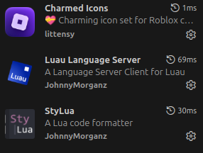

# How to get started
## 1. Download [Rokit](https://github.com/rojo-rbx/rokit/releases/latest).

## 2. Create a new folder to store this project in, then open that folder in VS Code.

## 3. Create a new profile in VS Code
On the bottom left of the editor is a gear icon by default. Click it to open a menu, then select Profile (???) → Profiles \
 \
There you can create a new profile that will be clean of any previous edits you made.

## 4. Download the following extensions in vs code (button showing 4 squares, with one being tilted on the left)


## 5. Open your VS Code settings
Ensure that the highlighted settings are checked


## 6. Clone the repository into the folder using the terminal
```
git clone https://github.com/Tea-Party-Studios/boss-fighter.git
```

## 7. run the following commands
```
rokit install
lune run wallyUpdate
```
If you are on Windows, you can also run this command to install the rojo plugin to Roblox Studio.
```
rojo plugin install
```
\
Your development environment is set up!